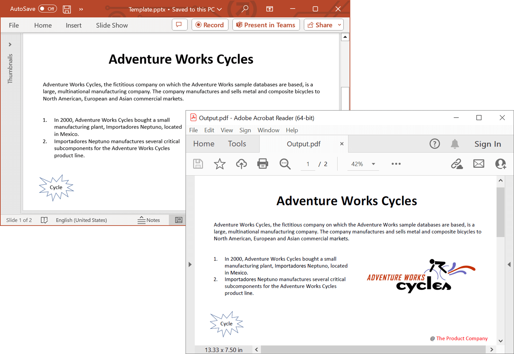

# Convert PowerPoint Presentation to PDF with advanced options in C#

This repository contains examples that illustrates how to convert PowerPoint presentations to PDFs with advanced options programmatically in C#. The Syncfusion&reg; [.NET PowerPoint library](https://www.syncfusion.com/document-processing/powerpoint-framework/net/powerpoint-library?utm_source=github&utm_medium=listing&utm_campaign=github-powerpoint-examples) (Presentation) provides a robust solution for converting presentations to PDF with just a few lines of code. It does not require Microsoft PowerPoint to be installed on the machine, and it preserves the original layout and formatting of the PowerPoint slides in the converted PDF

 
 

## Key Features

- **PPTX to PDF conversions**
  - [Convert PowerPoint to PDF](https://github.com/SyncfusionExamples/powerpoint-to-pdf-conversion-csharp/blob/master/PPTX-to-PDF-conversions/Convert-PowerPoint-to-PDF) - Convert PowerPoint presentation to PDF.
  - [Accessible PDF document](https://github.com/SyncfusionExamples/powerpoint-to-pdf-conversion-csharp/blob/master/PPTX-to-PDF-conversions/Accessible-PDF-document) - Convert PowerPoint presentation to PDF/UA (Section 508 compliant).
  - [PDF conformance level](https://github.com/SyncfusionExamples/powerpoint-to-pdf-conversion-csharp/blob/master/PPTX-to-PDF-conversions/PDF-conformance-level) - Convert PowerPoint presentation to PDF/A with various PDF conformance levels for long-term archiving and standardization.

- **PPTX to PDF advanced options**
  - [Handouts](https://github.com/SyncfusionExamples/powerpoint-to-pdf-conversion-csharp/blob/master/PPTX-to-PDF-advanced-options/Handouts) - Specify the number of slides per PDF page with Handouts option.
  - [Include-hidden-slides](https://github.com/SyncfusionExamples/powerpoint-to-pdf-conversion-csharp/blob/master/PPTX-to-PDF-advanced-options/Include-hidden-slides) - Skip or include hidden slides.
  - [Include-Notes-pages](https://github.com/SyncfusionExamples/powerpoint-to-pdf-conversion-csharp/blob/master/PPTX-to-PDF-advanced-options/Include-Notes-pages) - Convert slides with notes pages to PDF.
  - [Optimize identical images](https://github.com/SyncfusionExamples/powerpoint-to-pdf-conversion-csharp/blob/master/PPTX-to-PDF-advanced-options/Optimize-identical-images) - Optimize identical images to reduce PDF file size.

- **Fallback fonts**
  - [Default fallback fonts](https://github.com/SyncfusionExamples/powerpoint-to-pdf-conversion-csharp/blob/master/Fallback-fonts/Default-fallback-fonts) - Initialize default fallback fonts for a smoother conversion
  - [Based on script type](https://github.com/SyncfusionExamples/powerpoint-to-pdf-conversion-csharp/blob/master/Fallback-fonts/Based-on-script-type) - Set fallback fonts based on script type for unsupported glyphs.
  - [For range of Unicode](https://github.com/SyncfusionExamples/powerpoint-to-pdf-conversion-csharp/blob/master/Fallback-fonts/For-range-of-Unicode) - Set fallback fonts for characters when glyphs are not available.

- **Font substitution**
  - [Alternate font from installed](https://github.com/SyncfusionExamples/powerpoint-to-pdf-conversion-csharp/blob/master/Font-substitution/Alternate-font-from-installed) - Use alternate installed fonts when the original fonts are not available during PowerPoint to PDF conversion.
  - [Alternate font without installing](https://github.com/SyncfusionExamples/powerpoint-to-pdf-conversion-csharp/blob/master/Font-substitution/Alternate-font-without-installing) - Use alternate fonts without requiring font installation.

## Syncfusion&reg; .NET PowerPoint Library
------------------------------------------
The Syncfusion&reg; [.NET PowerPoint library](https://www.syncfusion.com/document-processing/powerpoint-framework/net/powerpoint-library?utm_source=github&utm_medium=listing&utm_campaign=github-powerpoint-examples) (Presentation) allows you to add advanced PowerPoint presentation processing functionalities to any .NET application and does not require Microsoft PowerPoint application to be installed in the machine. It is a non-UI component that provides a full-fledged PowerPoint presentation instance model similar to the Microsoft Office COM libraries to iterate with the presentation elements explicitly and perform necessary manipulation. 

Take a moment to peruse the [documentation](https://help.syncfusion.com/document-processing/powerpoint/powerpoint-library/net/getting-started?utm_source=github&utm_medium=listing&utm_campaign=github-powerpoint-examples), where you can find basic PowerPoint presentation processing options along with the features like create and edit [charts](https://help.syncfusion.com/document-processing/powerpoint/powerpoint-library/net/working-with-charts?utm_source=github&utm_medium=listing&utm_campaign=github-powerpoint-examples), [clone](https://help.syncfusion.com/document-processing/powerpoint/powerpoint-library/net/?utm_source=github&utm_medium=listing&utm_campaign=github-powerpoint-examples#cloning-slide) and [merge](https://help.syncfusion.com/document-processing/powerpoint/powerpoint-library/net/?utm_source=github&utm_medium=listing&utm_campaign=github-powerpoint-examples#merging-slide) slides in presentation, create and edit [animations](https://help.syncfusion.com/document-processing/powerpoint/powerpoint-library/net/working-with-animation?utm_source=github&utm_medium=listing&utm_campaign=github-powerpoint-examples#edit-existing-animation-effect) and [transistion](https://help.syncfusion.com/document-processing/powerpoint/powerpoint-library/net/create-edit-slide-transitions-in-powerpoint-presentation-slides-cs-vb-net?utm_source=github&utm_medium=listing&utm_campaign=github-powerpoint-examples#modify-a-transition-effect-applied-to-a-powerpoint-slide) effects, [protect](https://help.syncfusion.com/document-processing/powerpoint/powerpoint-library/net/security?utm_source=github&utm_medium=listing&utm_campaign=github-powerpoint-examples) the PowerPoint presentation, and most importantly, the [PDF](https://help.syncfusion.com/document-processing/powerpoint/conversions/powerpoint-to-pdf/net/presentation-to-pdf?utm_source=github&utm_medium=listing&utm_campaign=github-powerpoint-examples) and [Image](https://help.syncfusion.com/document-processing/powerpoint/conversions/powerpoint-to-image/net/presentation-to-image?utm_source=github&utm_medium=listing&utm_campaign=github-powerpoint-examples) conversions with code examples.

## Compatible Microsoft PowerPoint Versions
-------------------------------------------

- Microsoft PowerPoint 2007
- Microsoft PowerPoint 2010
- Microsoft PowerPoint 2013
- Microsoft PowerPoint 2016
- Microsoft PowerPoint 2019
- Microsoft 365

## Supported File Formats
-------------------------

*   Creates, reads, and edits popular presentation file formats like .PPTX, .PPTM, .POTX, and .POTM.
*   Converts PowerPoint presentation documents also to [PDF](https://help.syncfusion.com/document-processing/powerpoint/conversions/powerpoint-to-pdf/net/presentation-to-pdf?utm_source=github&utm_medium=listing&utm_campaign=github-powerpoint-examples) and [Image](https://help.syncfusion.com/document-processing/powerpoint/conversions/powerpoint-to-image/net/presentation-to-image?utm_source=github&utm_medium=listing&utm_campaign=github-powerpoint-examples) files.

## How to run the examples
--------------------------

*   Download this project to a location in your disk.
*   Open the solution file using Visual Studio.
*   Rebuild the solution to install the required NuGet packages.
*   Run the application.

## Resources
------------

- **Product page:** [Syncfusion&reg; PowerPoint Framework](https://www.syncfusion.com/document-processing/powerpoint-framework/net?utm_source=github&utm_medium=listing&utm_campaign=github-powerpoint-examples)
- **Documentation:** [Convert PowerPoint to PDF using Syncfusion&reg; PowerPoint library](https://help.syncfusion.com/document-processing/powerpoint/conversions/powerpoint-to-pdf/net/presentation-to-pdf?utm_source=github&utm_medium=listing&utm_campaign=github-powerpoint-examples)
- **GitHub Examples:** [Syncfusion&reg; PowerPoint library examples](https://github.com/SyncfusionExamples/PowerPoint-Examples?utm_source=github&utm_medium=listing&utm_campaign=github-powerpoint-examples)
- **Online demo:** [Syncfusion&reg; PowerPoint library - Online demos](https://ej2aspnetcore.azurewebsites.net/aspnetcore/powerpoint/pptxtopdf#/material3)

## Support and feedback
-----------------------

- For any other queries, reach our [Syncfusion&reg; support team](https://support.syncfusion.com/agent/tickets/create?utm_source=github&utm_medium=listing&utm_campaign=github-powerpoint-examples) or post the queries through the [community forums](https://www.syncfusion.com/forums?utm_source=github&utm_medium=listing&utm_campaign=github-powerpoint-examples).
- Request new feature through [Syncfusion&reg; feedback portal](https://www.syncfusion.com/feedback/home?utm_source=github&utm_medium=listing&utm_campaign=github-powerpoint-examples).

## License
----------

This is a commercial product and requires a paid license for possession or use. Syncfusion's licensed software, including this component, is subject to the terms and conditions of [Syncfusion's EULA](https://www.syncfusion.com/license/studio/22.2.5/syncfusion_essential_studio_eula.pdf). You can purchase a licnense [here](https://www.syncfusion.com/sales/products?utm_source=github&utm_medium=listing&utm_campaign=github-powerpoint-examples) or start a free 30-day trial [here](https://www.syncfusion.com/account/manage-trials/start-trials?utm_source=github&utm_medium=listing&utm_campaign=github-powerpoint-examples).